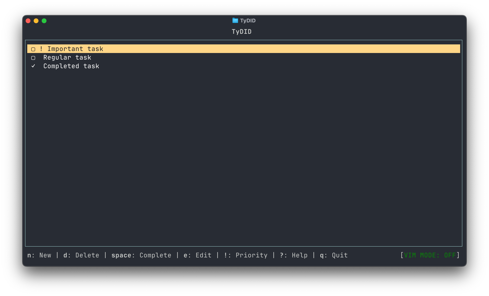

# TyDID

[](https://www.npmjs.com/package/tydid)
[](https://github.com/fynjirby/tydid)

Ultra Fast Terminal-based TODO application with a function of Vim-like navigation.

### Feel free to fork & contribute!

<p align="center">
  
</p>

## Features

- 📝 Create, edit, and manage tasks directly from your terminal
- ✅ Mark tasks as complete with a single keystroke
- ⭐ Flag important tasks with priority status
- ⌨️ Optional Vim mode for efficient keyboard navigation
- 💾 Automatic persistence of tasks between sessions
- 🔄 Simple and intuitive interface with keyboard shortcuts

## Installation

```bash
npm install -g tydid
```

## Usage

Run in terminal and enjoy!
```bash
tydid
```

## Programmatic Usage

You can also use TyDID as a library in your Node.js projects:
// you need to install it via `npm i tydid` first

```javascript
const tydid = require('tydid');

// Start the interactive UI
tydid.startApp();

// Or use the API directly
const task = tydid.addTask('Learn Node.js');
tydid.completeTask(task.id);
const allTasks = tydid.getTasks();
```

There is an example of usage in the `examples` directory.

## Configuration

TyDID stores your tasks in `~/.tydid/tasks.json` and settings in `~/.tydid/settings.json`.
